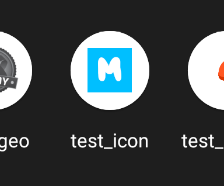
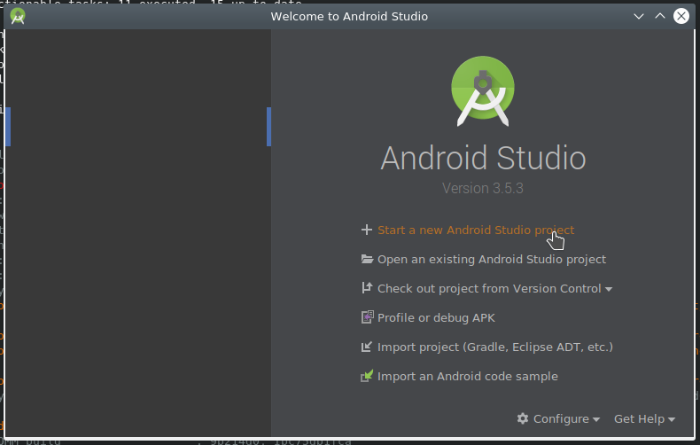
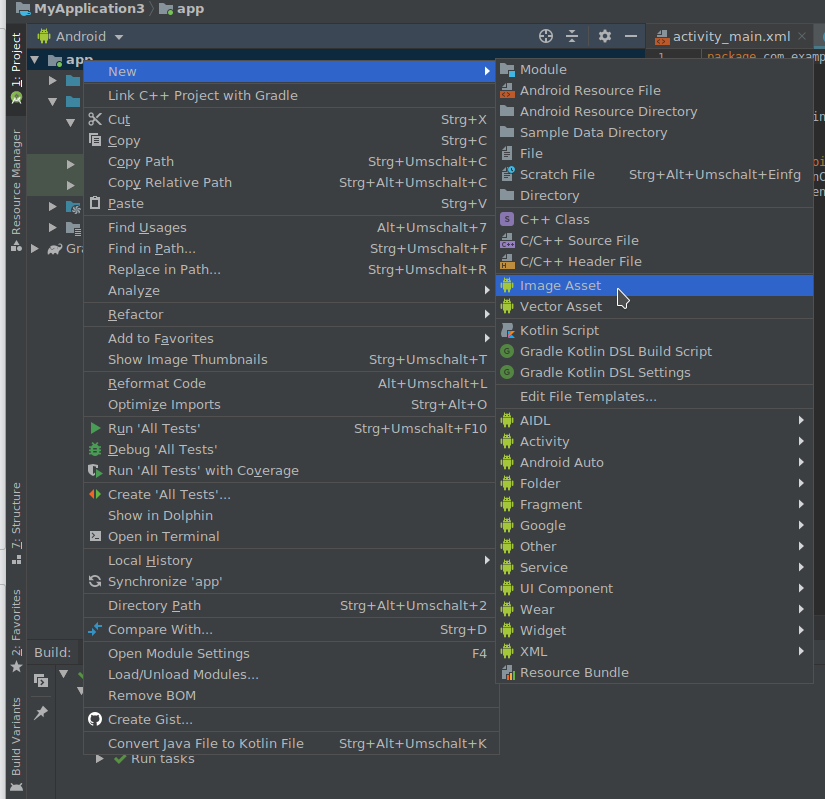
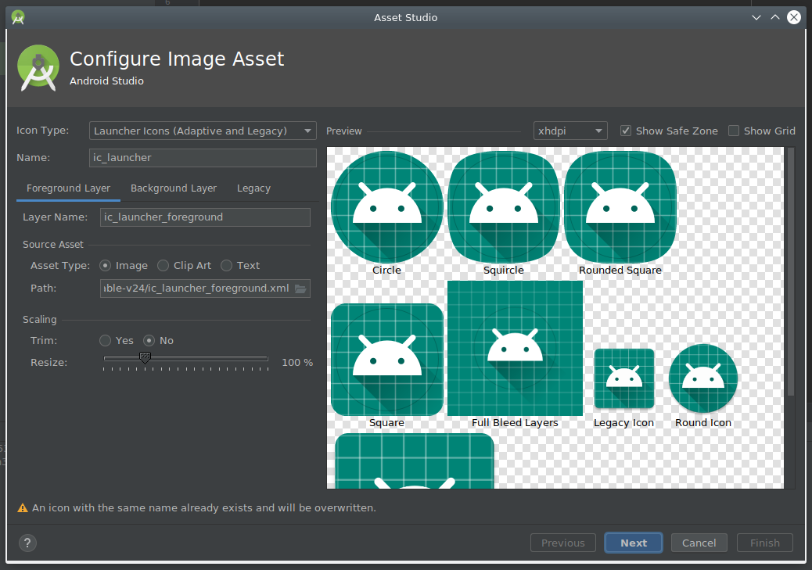
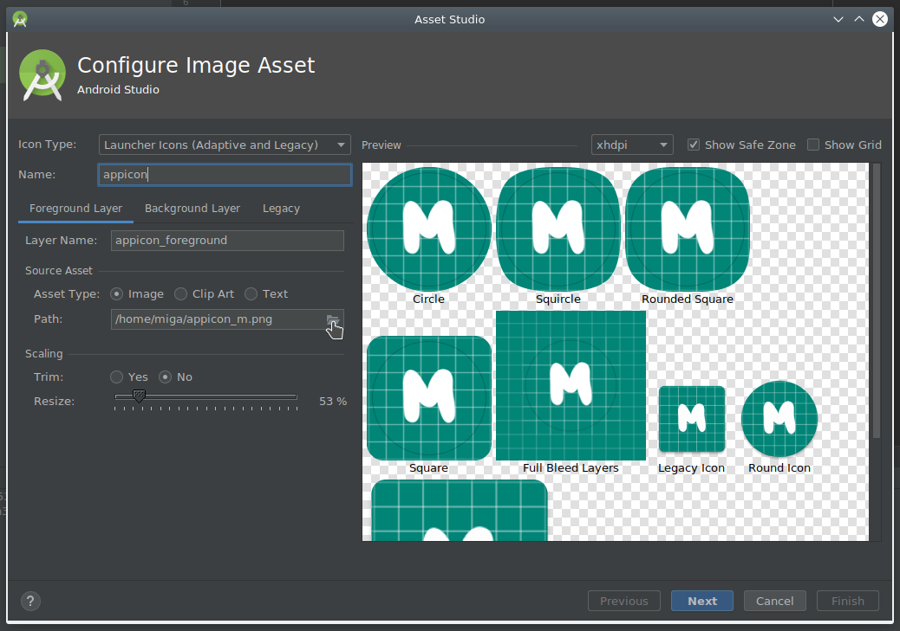
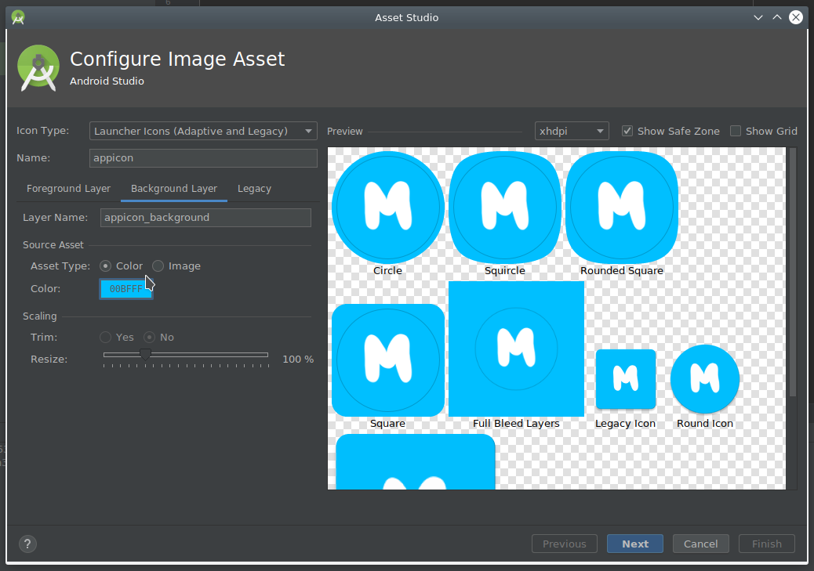

# [From zero to app](https://fromzerotoapp.com)

<span class="badge-buymeacoffee"><a href="https://www.buymeacoffee.com/miga" title="donate"></a></span> <a href="https://github.com/sponsors/m1ga"></a>

## Android Adaptive Icons


<!-- START doctoc generated TOC please keep comment here to allow auto update -->
<!-- DON'T EDIT THIS SECTION, INSTEAD RE-RUN doctoc TO UPDATE -->
**Table of Contents**  *generated with [DocToc](https://github.com/thlorenz/doctoc)*

- [From zero to app](#from-zero-to-app)
  - [Android Adaptive Icons](#android-adaptive-icons)
    - [Setup](#setup)
    - [Create the icon](#create-the-icon)
    - [Titanium app](#titanium-app)

<!-- END doctoc generated TOC please keep comment here to allow auto update -->

Starting with Android 8 (API 26) Google introduced the concept of `Adaptive Icons` which can display a variety of shapes across different device models. The main icon (foreground) is separated from the background (image, color, xml) and a mask is applied on top of the image.
If you create a new app and add an Android icon it will look like this with the default setup:

<br/>
the blue background is not filling up the whole space and the icon is a bit small. In this tutorial we will create an Adaptive Icon that will blend in with your other apps.

### Setup

The best and easiest way to do this is to use Android Studio. If you don't have it installed you can go to https://developer.android.com/studio and download it for free.

If your icon has just a plain color in the background you can create a transparent version of the foreground element and save that.

<br/>

If your background is a gradient or contains multiple colors you save that as a different file.

### Create the icon

1. Open up Android Studio and create a new project:

	<br/>

	Select an empty activity and just click next to create the project. We will just use the Asset Studio for the icon - the rest of project is not needed.

2. Right click on `app` and select `New - Image Asset`:

	<br/>

3. Now you will see the Asset Studio with the default icon/setup:

	<br/>

4. Rename the icon name to `appicon` (can be anything) and in the source asset select `Asset Type: Image` and select your icon in the `Path` field:

	<br/>

	With the `Scaling - Resize` slider you can adjust the size of the foreground element.

5. Now we will switch to the `Background Layer` tab and either set the plain color or load the background image:

	<br/>

	That's all! You can click next.

6. In the last screen you will see all the files in the `res` folder that you will need to copy over to your Titanium project:

	<br/>

### Titanium app

To use the Adaptive Icon in your Titanium app you have to add this to your tiapp.xml file:

```xml
<android xmlns:android="http://schemas.android.com/apk/res/android">
	<manifest xmlns:android="http://schemas.android.com/apk/res/android" android:versionCode="1">

		<application android:icon="@mipmap/appicon" android:roundIcon="@mipmap/appicon_round" />

	</manifest>
</android>
```

where `appicon` is the name you have put into the `name` box in step 4.

Now we can copy over all the files:

<table>
<tr>
<th>Android Studio:<br/>[project-name]/app/src/main/res/</th>
<th>Appcelerator Titanium:<br/>[app-name]/platform/android/res</th>
</tr>

<tr>
<td>/mipmap-anydpi-v26/appicon_round.xml</td>
<td>/mipmap-anydpi-v26/appicon_round.xml</td>
</tr>

<tr>
<td>/mipmap-anydpi-v26/appicon.xml</td>
<td>/mipmap-anydpi-v26/appicon.xml</td>
</tr>

<tr>
<td>/mipmap-hdpi/appicon_foreground.png</td>
<td>/mipmap-hdpi/appicon_foreground.png</td>
</tr>

<tr>
<td>/mipmap-hdpi/appicon_round.png</td>
<td>/mipmap-hdpi/appicon_round.png</td>
</tr>

<tr>
<td>/mipmap-hdpi/appicon.png</td>
<td>/mipmap-hdpi/appicon.png</td>
</tr>

<tr>
<td><i>same for all the other mipmap-* folders</i></td>
<td><i>same for all the other mipmap-* folders</i></td>
</tr>

<tr>
<td>/values/appicon_background.xml</td>
<td>/values/appicon_background.xml</td>
</tr>

</table>

When you compile your app it will show the correct icon now:

<br/>
