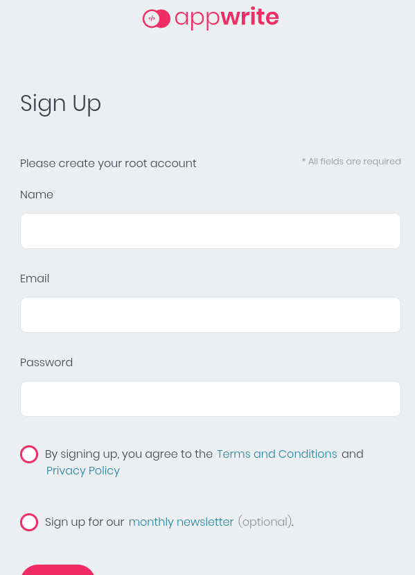
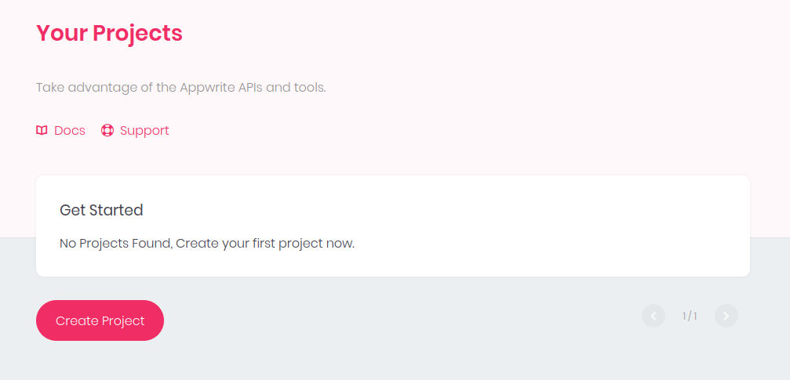
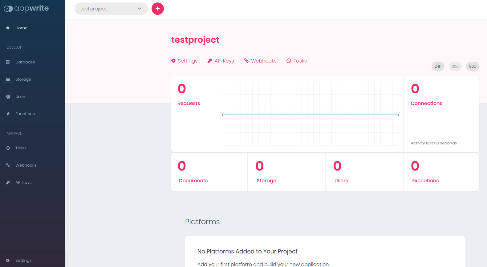
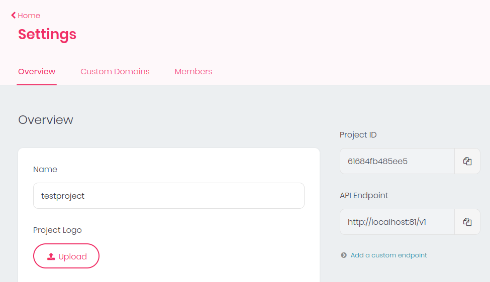
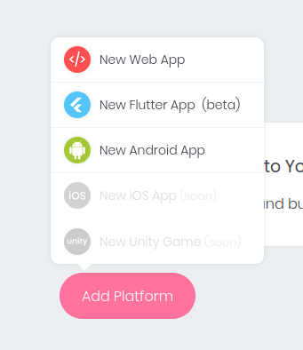
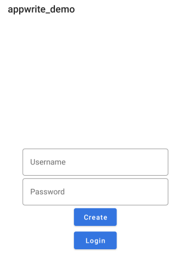
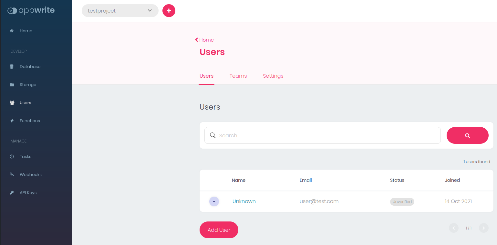
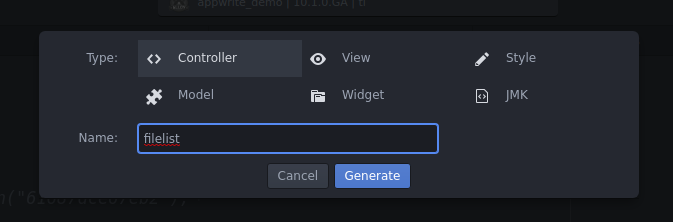
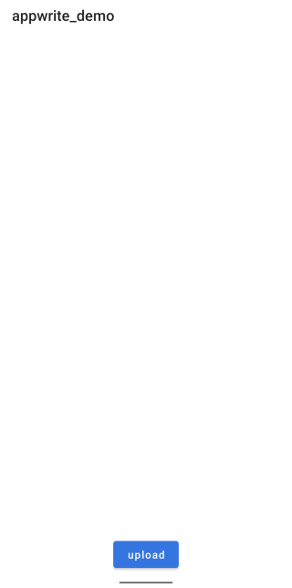
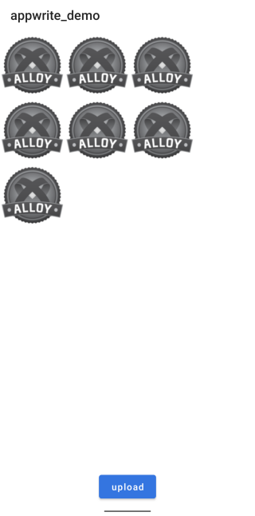

[From zero to app](https://github.com/m1ga/from_zero_to_app)

<span class="badge-buymeacoffee"><a href="https://www.buymeacoffee.com/miga" title="donate"></a></span>

# Appwrite + Appcelerator Titanium: A step by step guide

In this tutorial we setup an Appwrite docker instance and create a simple Titanium app and connect it to Appwrite - step by step! We will create a user login and upload/retrive some data.

## Appwrite installation

### Docker setup

Appwrite is a self-hosted docker and can be installed with
```bash
docker run -it --rm \
    --volume /var/run/docker.sock:/var/run/docker.sock \
    --volume "$(pwd)"/appwrite:/usr/src/code/appwrite:rw \
    --entrypoint="install" \
    appwrite/appwrite:0.10.4
```
_If you have a `folder not found` error you'll need to create an `/appwrite` folder._

For more information visit https://appwrite.io/docs.

### Appwrite Dashboard

When the docker image is running you can open the URL in your browser and will see the first Appwrite screen:



Create an account and a project in the following screen:



and you will be transfered to the project dashboard:



This is the main view where we will manage all our data that is coming from the app.

In order to connect our apps we will need the project ID and the API url. To do that we click on `Settings` (below the project name) and you will find the `Project ID` and `API Endpoint` on the right side:



Copy those values as we will need them in the app later on.

One last thing we will need to do is: add a platform.
Go to the dashboard home screen again and scroll down to `Add platform` and select `Android`.



Add your app name (e.g. `appwrite_demo`) and package name (e.g. `com.user.appwritedemo`) and click register.

Now we can start to write the app!


## Titanium App

If you are new to Titanum have a look at the tutorials at https://fromzerotoapp.com

### Create the app

Run the following commands and create a new app:
```bash
ti create
```

set the appname and app id to the values you've added in the platform settings above (e.g. `appwrite_demo` and `com.user.appwritedemo`). Then go into you app folder and create an `alloy` project:

```bash
cd appwrite_demo/
alloy new
```

and open Atom/VSCode inside the folder.

### Add the Titanium Appwrite module

Goto https://github.com/m1ga/ti.appwrite and download the module. Place the ZIP file in your app root folder and add this to your `tiapp.xml`:

```xml
<modules>
	<module>ti.appwrite</module>
</modules>
  ```
When you build your app now with `ti build -p android` it will extract the module and you can use it now.


### Connect to the Appwrite server

The first step is the server connection. Add this into `index.js`:

```js
const appwrite = require("ti.appwrite");
const SERVER_URL = "http://192.168.0.59:81/v1"
const PROJECT_ID = "61684fb485ee5";

appwrite.create({
	endpoint: SERVER_URL,
	project: PROJECT_ID,
	selfSigned: true,
});
```
and change the SERVER_URL and PROJECT_ID to the values you have copied from the project settings page before. Keep in mind that you have to use the IP if you test on an external Android device!

When everything is correct you will see `connected: http://192.168.0.59:81/v1` in your output log and we can continue with the user login.

### User login

We create a simple login screen in the index view:

index.xml
```xml
<Alloy>
	<Window>
		<View id="view_login">
      <TextField hintText="Username" id="tf_username"/>
			<TextField hintText="Password" id="tf_password"/>
			<Button title="Create" onClick="onClickCreate"/>
			<Button title="Login" onClick="onClickLogin"/>
		</View>
	</Window>
</Alloy>
```

index.tss
```css
"#view_login" : {
	layout: "vertical",
	width: Ti.UI.SIZE,
	height: Ti.UI.SIZE
}
"TextField" : {
	borderStyle: Ti.UI.INPUT_BORDERSTYLE_ROUNDED,
	hintType: Ti.UI.HINT_TYPE_ANIMATED,
	width: 300
}
"#tf_password": {
	passwordMask: true
}
"#tf_username": {
	keyboardType: Ti.UI.KEYBOARD_TYPE_EMAIL
}

```

app.tss
```css
'Window' : {
  backgroundColor: '#fff'
}
"Label" : {
  width: Ti.UI.SIZE,
  height: Ti.UI.SIZE,
  color: "#000",
  touchEnabled: false
}
```

index.js
```js
const appwrite = require("ti.appwrite");
const SERVER_URL = "http://192.168.0.59:81/v1"
const PROJECT_ID = "61684fb485ee5";

appwrite.create({
	endpoint: SERVER_URL,
	project: PROJECT_ID,
	selfSigned: true,
});

appwrite.addEventListener("account", accountEvent);
function accountEvent(e) {
	console.log(JSON.stringify(e));
}

appwrite.addEventListener("error", function(e) {
	console.log(JSON.stringify(e));
})

$.index.open();

function onClickCreate(e) {}

function onClickLogin(e) {}
```

It will look like this:


The following code is used to create an user account:

```js
function onClickCreate(e) {
	appwrite.createAccount({
		email: $.tf_username.value,
		password: $.tf_password.value
	});
}
```

A click on `Create` will create a user and the `account` event will print user details to the console. When you look at the Appwrite dashboard - User section you can see the new user in there too:



Now that we have a user we can add the login method:

```js
function onClickLogin(e) {
	appwrite.createSession({
		email: $.tf_username.value,
		password: $.tf_password.value
	});
}
```

and extend the `account` event to:
```js
function accountEvent(e) {
	console.log(JSON.stringify(e));
	if (e.session_id) {
		console.log("session id", e.session_id);
	}
}
```

That allows us to login and if you see a `session id` in your log it was successful.

Once we've made a login we can call `appwrite.getAccount();` next time and check the `account` event result if the session is still valid or if we receive an `error` event.

A valid session will return e.g.
```json
{
  "type": "account",
  "passwordUpdate": 1634230793,
  "emailVerification": false,
  "name": "",
  "action": "getAccount",
  "registration": 1634230793,
  "id": "616862096c70b",
  "email": "user@test.com",
  "status": 0,
  "prefs": "{}",
}
```

and invalid or deleted session will return this `error`:
```json
{
  "type": "error",
  "action": "get account",
  "code": 401,
  "message": "User (role: guest) missing scope (account)",
  "response": "{\"message\":\"User (role: guest) missing scope (account)\",\"code\":401,\"version\":\"0.10.4\"}",
  "bubbles": false,
  "cancelBubble": false
}
```

With this information we can call a differnt window when either  `action: "getAccount"` or `action: "login"` is returned by the `account` event.

### Share files

Create a second controller inside your editor called `filelist`



which will be used to display files and upload a file to the server.

As said before we need to add one thing to our `index.js` so it will open the new window. Extend your `account` event to look like this:

```js
function accountEvent(e) {
	console.log(JSON.stringify(e));
	if (e.session_id) {
		console.log("session id", e.session_id);
	}

	if (e.action == "getAccount" || e.action == "login") {
		// remove this event here
		appwrite.removeEventListener("account", accountEvent);

		// open second window
		var win = Alloy.createController("/filelist").getView();
		win.open();
	}
}
```

As soon as we have one of the correct events it will create and open the `filelist` controller.

To keep it simple we add a simple ScrollView and a Button to the `filelist` controller like this:

filelist.xml
```xml
<Alloy>
	<Window onOpen="onOpen">
		<ScrollView id="scroller" />
		<Button id="btn" title="upload" onClick="onClickUpload"/>
	</Window>
</Alloy>
```

filelist.tss
```css
"#scroller" : {
  height: Ti.UI.FILL,
  width: Ti.UI.FILL,
  contentHeight: Ti.UI.SIZE,
  contentWidth: Ti.UI.FILL,
  layout:"horizontal"
}
"#btn" : {
  bottom: 5
}
```

filelist.js
```js
// appwrite object
var appwrite = require("ti.appwrite");

// appwrite events
appwrite.addEventListener("account", function(e) {
	console.log(JSON.stringify(e));
})
appwrite.addEventListener("error", function(e) {
	console.log(JSON.stringify(e));
})

function onClickUpload(e){}
function onOpen(e) {
	appwrite.getAccount();
}
```

When you will start your app it will open the second window now and we can add the file upload.

Our beautiful new empty window:


#### Upload files

Inside this tutorial we will going to upload the appicon to our appwrite instance. This file is located in the `assets/android` rsource folder and we have to copy it to the `applicationDataDirectory` folder so the module can access it. To do this add the following code into the `onClickUpload` method:

```js
function onClickUpload(e) {
	// get the icon
	var file = Ti.Filesystem.getFile(Ti.Filesystem.applicationDataDirectory, "appicon.png");

	if (!file.exists()) {
		// copy it from /assets/ to the external storage
		var source = Ti.Filesystem.getFile(Ti.Filesystem.resourcesDirectory, "appicon.png");
		file.write(source.read());
	}
}
```

Now we can take that file and send it to our server:
```js
function onClickUpload(e) {
	// get the icon
	var file = Ti.Filesystem.getFile(Ti.Filesystem.applicationDataDirectory, "appicon.png");

	if (!file.exists()) {
		// copy it from /assets/ to the external storage
		var source = Ti.Filesystem.getFile(Ti.Filesystem.resourcesDirectory, "appicon.png");
		file.write(source.read());
	}

	// upload file if exists
	if (file.exists()) {
		appwrite.createFile({
			file: file,
			read: ["*"],
			write: ["*"]
		});
	}
}
```

Clicking the button will upload the icon. To check if is working you can add the `storage` event and also check the Appwrite storage page:

```js
appwrite.addEventListener("storage", function(e) {
	console.log(JSON.stringify(e));
})
```


#### Get files

To check all server files we call `appwrite.listFiles();` inside the `open` event:

```js
function onOpen(e) {
	appwrite.getAccount();
  appwrite.listFiles();
}
```

and inside the `storage` event you will get a list of all files:
```json
{
  "type": "storage",
  "action": "list files",
  "files": [{
    "name": "appicon.png",
    "id": "616886dfb94b1",
    "dateCreated": 1634240223,
    "mimeType": "image/png",
    "signature": "bc6801521a45d0aaec630e5a11c487fd",
    "permissions": ""
  }]
}
```

The last step is to download and show the images again. Todo this we parse the files list and start a file download. The `storage` event will receive a blob that we can put into an ImageView and add it into the ScrollView:

```js
appwrite.addEventListener("storage", function(e) {
	// download and it contains a blob
	if (e.action == "downloadFile" && e.blob) {
		// create an ImageView
		var img = Ti.UI.createImageView({
			width: 100,
			height: 100,
			image: e.blob // add the blob
		});
		// add it to the ScrollView
		$.scroller.add(img);
	} else if (e.action == "createFile") {
		// file was uploaded - clear list and add all files
		$.scroller.removeAllChildren();
		appwrite.listFiles();
	} else {
		console.log(JSON.stringify(e));

		// we have some files
		if (e.files && e.files.length > 0) {
			// parse all files
			_.each(e.files, function(file) {
				// download a file
				appwrite.downloadFile(file.id);
			})
		}
	}
})
```

Clicking upload multiple times will result in:



## Optimizations

This app demonstrates a basic usage of Titanium and the Appwrite module. There are many things that can be optimized for a better UX and API flow. For example we didn't check the user session and close the 2nd window if there is no session. Also we didn't look at the `error` event and handle those.
There are other API calls to logout a user or delete files and so on. A full example can be seen at https://github.com/m1ga/ti.appwrite

## Author

* Michael Gangolf (<a href="https://github.com/m1ga">@MichaelGangolf</a> / <a href="https://www.migaweb.de">Web</a>)

<span class="badge-buymeacoffee"><a href="https://www.buymeacoffee.com/miga" title="donate"></a></span>
