# [From zero to app](https://fromzerotoapp.com)

<span class="badge-buymeacoffee"><a href="https://www.buymeacoffee.com/miga" title="donate"></a></span>

<!-- START doctoc generated TOC please keep comment here to allow auto update -->
<!-- DON'T EDIT THIS SECTION, INSTEAD RE-RUN doctoc TO UPDATE -->
**Table of Contents**  *generated with [DocToc](https://github.com/thlorenz/doctoc)*

 - [Basic app UI's](#basic-app-uis)
	- [Plain setup](#plain-setup)
	- [Open other windows](#open-other-windows)
	- [Navigation Window](#navigation-window)
    	- [Platform specific styling](#platform-specific-styling)
    - [Tab group](#tab-group)
    - [DrawerLayout](#drawerlayout)

<!-- END doctoc generated TOC please keep comment here to allow auto update -->


## Basic app UI's

In this tutorial we will have a look at some basic app UI's and how to navigate between windows.  It will start with a basic window and uses some more complex setups you will find in other apps, too. Of course you can always create a custom menu and navigate from window to another but here we will cover some basic/native ways to do so.

### Plain setup

The first and easiest solution is to create a plain window that allows you to fully customize the content. The Alloy XML part looks like this:

_index.xml_
```xml
<Alloy>
	<Window title="Window"/>
</Alloy>
```

_index.js_
```javascript
$.index.open();
```

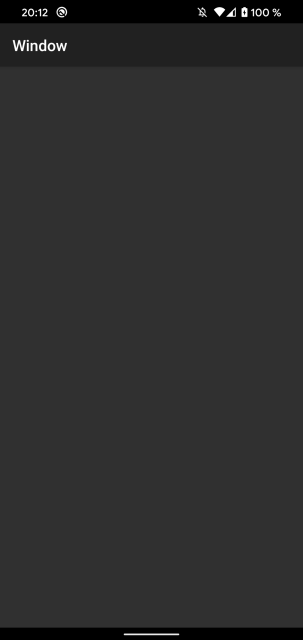


Inside the Window tag you can add all other like Buttons, Labels, Images and so on.

### Open other windows

Of course most of the apps consist of multiple windows. To do that we will add a Button to the first window:

_index.xml_
```xml
<Alloy>
	<Window title="Window">
		<Button title="open new window" onClick="onClickButton"/>
	</Window>
</Alloy>
```

_index.js_
```javascript
function onClickButton(e) {
	// click event
}

$.index.open();
```

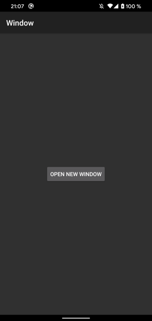


Now we create a second controller; either with `alloy generate controller [controllerName]` or inside the UI by clicking the + button in the top right corner (e.g. in Atom).
Name the second controller "secondWindow" and add a window inside the new XML:

_secondWindow.xml_
```xml
<Alloy>
	<Window title="Window two" backgroundColor="#AAF"/>
</Alloy>
```
_secondWindow.js_
```javascript
$.secondWindow.open();
```

To open the second window we need to create a new controller inside the click event of the first window:

_index.js_
```javascript
function onClickButton(e) {
	// click event
	Alloy.createController("/secondWindow");
}

$.index.open();
```

Now the second window will open when you click the button.

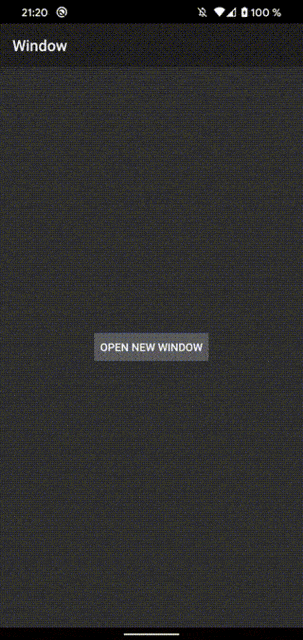

As you can see you have to close the window by using the e.g. swipe gesture. To have a structure between the main window and the child windows we can use a `NavigationWindow`.

### Navigation Window

We use the project structure from the first example and we add a `NavigationWindow` around the window:

_index.xml_
```xml
<Alloy>
	<NavigationWindow id="navWin">
		<Window title="Window">
			<Button title="open new window" onClick="onClickButton"/>
		</Window>
	</NavigationWindow>
</Alloy>
```

Inside the controller we change some parts too:

_index.js_
```javascript
function onClickButton(e) {
	// click event
	var win2 = Alloy.createController("/secondWindow");
	$.navWin.openWindow(win2.getView());
}

$.navWin.open();
```

Now it will open the `NavigationWindow` and we use `openWindow` to open the child window.

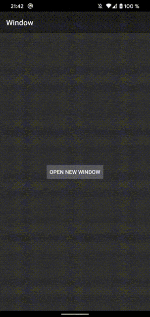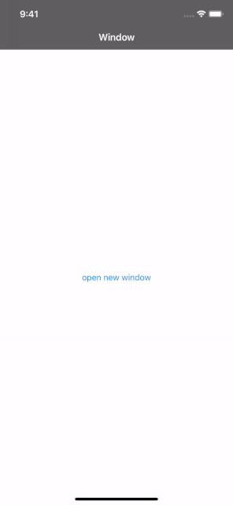

As you can see the second window has a back button now and on iOS you see a window title.

#### Platform specific styling
Adding some platform specific styles and xml parts makes it behave more native:

_index.tss_
```css
"Window" : {
	backgroundColor: "white"
}
"Window[platform=ios]" : {
	titleAttributes: {
		color: '#000'
	},
	largeTitleEnabled: true,
	largeTitleDisplayMode: Ti.UI.iOS.LARGE_TITLE_DISPLAY_MODE_ALWAYS
}
```

_secondWindow.xml_
```xml
<Alloy>
	<Window title="Window two" backgroundColor="#AAF">
		<ActionBar id="actionbar" platform="android" onHomeIconItemSelected="onClickClose" displayHomeAsUp="true"/>
	</Window>
</Alloy>
```

_secondWindow.js_
```javascript
var args = $.args;

function onClickClose(e){
	$.secondWindow.close();
}
```

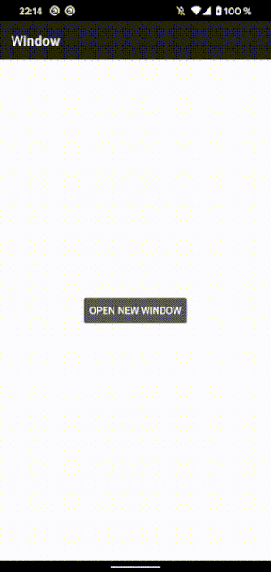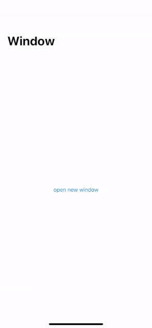

### Tab group

Another UI concept is a `TabGroup`. It will take multiple windows in one `TabGroup` and you have a menu at the top or bottom to switch betweeen those (or swipe).

_index.xml_
```xml
<Alloy>
	<TabGroup backgroundColor="white" title="TabGroup">
		<Tab id="tab1" title="Tab 1">
			<Window id="win1" title="Tab 1">
				<Label id="label1" color="#999">I am Window 1</Label>
			</Window>
		</Tab>
		<Tab id="tab2" title="Tab 2">
			<Window id="win2" title="Tab 2">
				<Label id="label2" color="#999">I am Window 2</Label>
			</Window>
		</Tab>
	</TabGroup>
</Alloy>
```

_index.js_
```javascript
$.index.open();
```

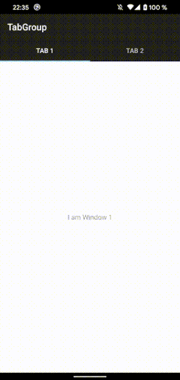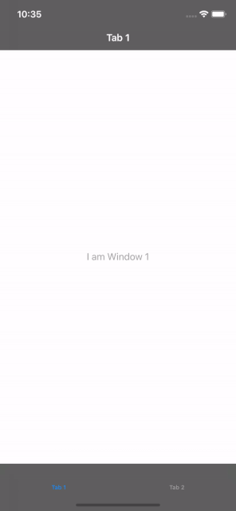

As you can see the default `TabGroup` menu on Android is at the top.

#### BottomNavigation

You can also change the Android style to a BottomNavigation and or add some icons to the `assets/images/` folder and change the style to:

_index.xml_
```xml
<Alloy>
	<TabGroup backgroundColor="white" title="TabGroup">
		<Tab id="tab1" title="Tab 1" icon="icon1.png">
			<Window id="win1" title="Tab 1">
				<Label id="label1" color="#999">I am Window 1</Label>
			</Window>
		</Tab>
		<Tab id="tab2" title="Tab 2" icon="icon1.png">
			<Window id="win2" title="Tab 2">
				<Label id="label2" color="#999">I am Window 2</Label>
			</Window>
		</Tab>
	</TabGroup>
</Alloy>
```

_index.tss_
```css
"TabGroup":{
	tabsBackgroundSelectedColor:"#999",
	tabsBackgroundColor: "#000"
}
"Tab":{
	activeTitleColor:"#fff",
	titleColor: "#f00",
}
"TabGroup[platform=android]": {
	style: Ti.UI.Android.TABS_STYLE_BOTTOM_NAVIGATION
}
```
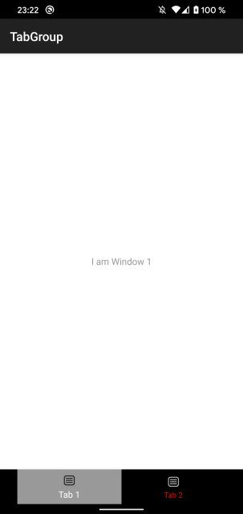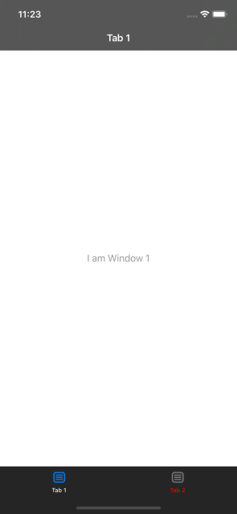


### DrawerLayout (Android specific)

Android has a custom layout called "DrawerLayout". It is using a hamburger menu with a left/right panel and a center view. The basic layout looks like this:

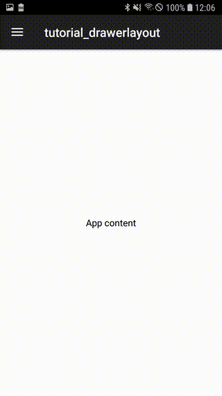

<i>index.xml</i>
```xml
<Alloy>
	<Window>
		<ActionBar platform="android" displayHomeAsUp="true" onHomeIconItemSelected="onClickToggle"/>
		<DrawerLayout id="drawer" platform="android">
			<LeftView>
				<View backgroundColor="#fff">
					<Label text="Side menu"/>
				</View>
			</LeftView>
			<CenterView>
				<View backgroundColor="#fff">
					<Label text="App content"/>
				</View>
			</CenterView>
		</DrawerLayout>
	</Window>
</Alloy>
```

<i>index.js</i>

```javascript

function onClickToggle(e){
	$.drawer.toggleLeft();
}

$.index.open();
```

To make it a bit more flexible if you want to use it for iOS too we move the view part out of the XML and into the controller:

<i>index.xml</i>
```xml
<Alloy>
	<Window>
		<ActionBar platform="android" displayHomeAsUp="true" onHomeIconItemSelected="onClickToggle"/>
		<DrawerLayout id="drawer" platform="android" />
	</Window>
</Alloy>
```

<i>index.js</i>
```javascript
var centerView = Ti.UI.createView({
	backgroundColor: "#fff"
});
var leftView = Ti.UI.createView({
	backgroundColor: "#fff"
});

var lbl1 = Ti.UI.createLabel({
	text: "center",
	color: "#000"
})

var lbl2 = Ti.UI.createLabel({
	text: "left",
	color: "#000"
})

centerView.add(lbl1);
leftView.add(lbl2);

if (OS_ANDROID){
	$.drawer.centerView = centerView;
	$.drawer.leftView = leftView;
}

function onClickToggle(e){
	$.drawer.toggleLeft();
}

$.index.open();
```

With this setup you can create a custom layout for iOS and use the same views without having duplicate content. To have the same hamburger menu setup on iOS you can create a custom layout or use a plugin like https://github.com/viezel/NappDrawer. The controller would look like this:

```javascript
if (OS_IOS){
	var NappDrawerModule = require('dk.napp.drawer');
	var mainWindow = NappDrawerModule.createDrawer({
		centerWindow: $.index,
		leftWindow: leftView,
		openDrawerGestureMode: NappDrawerModule.OPEN_MODE_NONE,
		closeDrawerGestureMode: NappDrawerModule.CLOSE_MODE_TAP_CENTERWINDOW | NappDrawerModule.CLOSE_MODE_PANNING_CENTERWINDOW,
		statusBarStyle: NappDrawerModule.STATUSBAR_WHITE,
		orientationModes: [Ti.UI.PORTRAIT, Ti.UI.UPSIDE_PORTRAIT]
	});
	$.index.add(centerView);
	mainWindow.open();
}
```
We will cover modules in a different tutorial.
