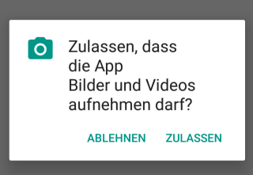

# [From zero to app](https://fromzerotoapp.com)

<span class="badge-buymeacoffee"><a href="https://www.buymeacoffee.com/miga" title="donate"></a></span>

## Use the camera

<!-- START doctoc generated TOC please keep comment here to allow auto update -->
<!-- DON'T EDIT THIS SECTION, INSTEAD RE-RUN doctoc TO UPDATE -->
**Table of Contents**  *generated with [DocToc](https://github.com/thlorenz/doctoc)*

- [From zero to app](#from-zero-to-app)
  - [Use the camera](#use-the-camera)
  - [Project setup](#project-setup)
  - [Permissions](#permissions)
  - [Say cheese](#say-cheese)

<!-- END doctoc generated TOC please keep comment here to allow auto update -->

Another must have feature in an app is to access the camera and take pictures or videos. In this short tutorial we will create a small app that adds a 'take a picture' button.

## Project setup

We will start with an empty Alloy project.
```bash
ti create
# go into the folder
alloy new
```
Have a look at the last section of the [first tutorial](./first_app.md#create-a-new---clean-project).


## Permissions

For security reasons both Android and iOS needs to ask the user first to access the camera. For iOS you need to add a key to the `tiapp.xml`:

```xml
<ios>
	<plist>
		<dict>
			<key>NSCameraUsageDescription</key>
			<string>To take a picture we want to use the camera</string>

			<!-- needed for video -->
			<key>NSCameraUsageDescription</key>
			<string>For Video recording we want to use the microphone</string>
		</dict>
	</plist>
</ios>
```

and for Android this needs to be added to the manifest:
```xml
<android xmlns:android="http://schemas.android.com/apk/res/android">
	<manifest>
		<uses-permission android:name="android.permission.CAMERA"/>

		<uses-permission android:name="android.permission.READ_EXTERNAL_STORAGE"/>
		<uses-permission android:name="android.permission.WRITE_EXTERNAL_STORAGE"/>
	</manifest>
</android>
```

Then inside the app itself we need to ask for permission again which the users has to accept or decline.



Titanium has build-in functions to request these permissions. Since it might be handy to use this in other apps to we create an external library and include the code there so we can use this file in other apps to. To do this you have to create a `lib` folder at `/app/lib/` and inside this folder we create a new file called `helper.js`.

There we add our `getPermissions()` script:
```javascript
exports.getPermissions = function(opt) {
	//
}
```

The code for Android and iOS is a bit different so we check for the platform and ask for the specific platform permission.


```javascript
exports.getPermissions = function(opt) {
	if (OS_ANDROID) {
		// Android part
		var permissions = ['android.permission.CAMERA', 'android.permission.READ_EXTERNAL_STORAGE'];
		var hasPermission = Ti.Android.hasPermission(permissions);

		// check if the permissions are already allowed
		if (hasPermission) {
			// run callback
			opt();
			return;
		}
		// no permission - request it
		Ti.Android.requestPermissions(permissions, function(e) {
			if (e.successs) {
				// run callback
				opt();
			} else {
				// ask again
				exports.getPermissions(opt);
			}
		});
	} else {
		// iOS part
		var map = {};
		map[Ti.Media.CAMERA_AUTHORIZATION_AUTHORIZED] = 'CAMERA_AUTHORIZATION_AUTHORIZED';
		map[Ti.Media.CAMERA_AUTHORIZATION_DENIED] = 'CAMERA_AUTHORIZATION_DENIED';
		map[Ti.Media.CAMERA_AUTHORIZATION_RESTRICTED] = 'CAMERA_AUTHORIZATION_RESTRICTED';
		map[Ti.Media.CAMERA_AUTHORIZATION_NOT_DETERMINED] = 'CAMERA_AUTHORIZATION_NOT_DETERMINED';

		var cameraAuthorization = Ti.Media.cameraAuthorization;
		if (cameraAuthorization === Ti.Media.CAMERA_AUTHORIZATION_RESTRICTED) {
			return;
		} else if (cameraAuthorization === Ti.Media.CAMERA_AUTHORIZATION_DENIED) {
			return;
		}
		Ti.Media.requestCameraPermissions(function(e) {
			if (e.success) {
				// run callback
				opt();
			} else {
				// ask again
				exports.getPermissions(opt);
			}
		});
	}
}
```

## Say cheese

Now that we can ask for the permission it is time to open the camera! We add a simple button to our view and add a `click` event to it so we can open the camera.

```xml
<Alloy>
	<Window>
		<Button id="btn_record" title="Take a picture" />
	</Window>
</Alloy>
```

```javascript
function onClickRecord(e) {}

$.btn_record.addEventListener("click",onClickRecord);
$.index.open();
```

All we need to do now is call our `getPermissions()` helper script and once we have the correct permission we can open the camera. To use the `lib/helper.js` we need to `require()` it:

```javascript
var helper = require("/helper");
```

Then we can use all export functions in our code:
```javascript
helper.getPermissions(function(){});
```

The last part is opening the camera:
```javascript
Ti.Media.showCamera({});
```

So the whole code will look like this:
```javascript
var helper = require("/helper");

function onClickRecord(e) {
	helper.getPermissions(function(){
		// permission granted

		// open the camera
		Ti.Media.showCamera({})
	});
}

$.btn_record.addEventListener("click",onClickRecord);
$.index.open();
```

If you click the button now it will ask you for camera and storage permission the first time and then open the camera.

The `showCamera()` method has some properties you can set to change some options and to get the image. For a full list check out: https://titaniumsdk.com/api/structs/cameraoptionstype.html

The most common option is the `success` callback. This will be called after the images was taken and you can get the actual image to show it in your app or store it.

```javascript
Ti.Media.showCamera({
	success: function(e) {
		// display image information:
		console.log(e.media);
		// $.imageView.image = e.media;	// to put it into an imageview
	}
})
```

You can also add a custom overlay to the camera with `overlay`. When you set an overlay it won't run the normal camera as an intent but it will create a custom camera view for you. You have to take care of the actions/buttons (`Ti.Media.takePicture()`,`Ti.Media.hideCamera()`,...) yourself! `overlay` accepts a view as a parameter.
