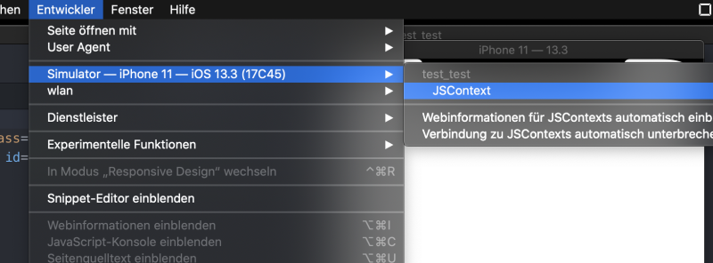
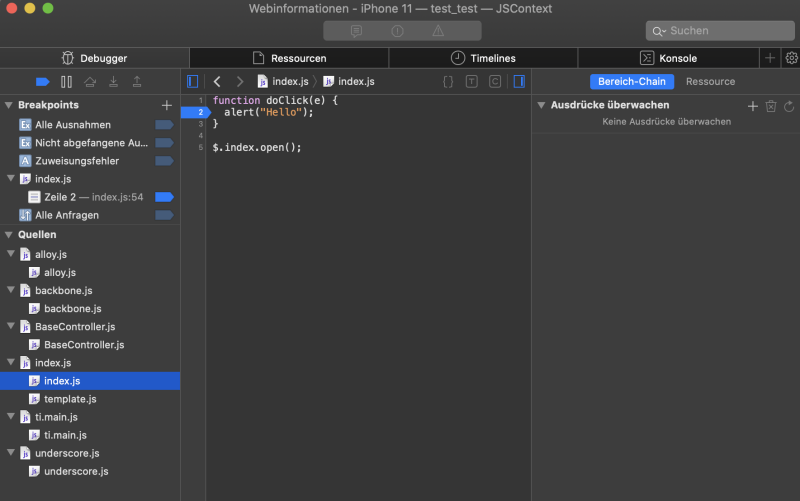

# [From zero to app](https://fromzerotoapp.com)

<span class="badge-buymeacoffee"><a href="https://www.buymeacoffee.com/miga" title="donate"></a></span>

To debug WebViews have a look at <a href="./debugging_webviews.md">Debugging WebViews</a>.<br/>
If you are interested in debugging using VS Code have a look at <a href="https://devblog.axway.com/mobile-apps/vs-code-debugging-for-titanium/">https://devblog.axway.com/mobile-apps/vs-code-debugging-for-titanium/</a>

## Android

### Debugging using Chrome DevTools

Sometimes you have an error in your app where you don't know why and it is hard to find the source. Then you end up adding a lot of `console.log()` in your code or you can use the Chrome DevTools to debug your app and even use breakpoints.

In a Titanium app you can add `--debug-host localhost:8989` to your build command to start a debug listener.

```bash
ti build -p android  -T device --debug-host localhost:8989
```

When the app starts up it will freeze at the Splashscreen and you will see an URL it the console:


open that `chrome-devtools://...` URL inside Chrome and it will open the DevTools for you. To get your app running again you have to press the `Pause/Play` button in the top right corner.

Now you can use the DevTools to check values, set breakpoints or inspect items like you would do in a web page:


## iOS

### Debugging using Safari DevTools

For iOS you can almost do the same. You just use the Safari DevTools and you can use the normal build command. Start your app on your Simulator and open Safari. Go to the "Developer" menu and select your Simulator - JSContext.  

<br/>

Now you can open files, set breakpoints and analyse variables:

<br/>

For more details visit: https://docs.appcelerator.com/platform/latest/#!/guide/Debugging_iOS_Apps_with_3rd-party_Tools
