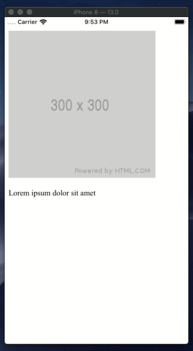
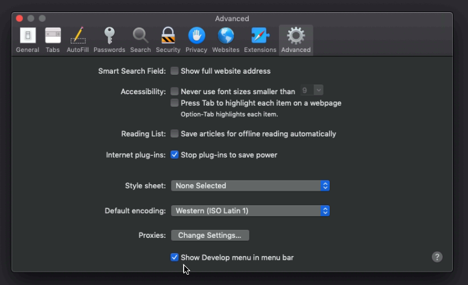
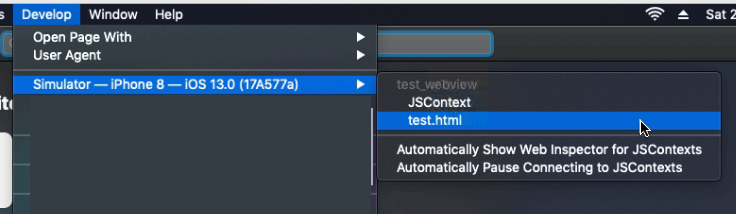
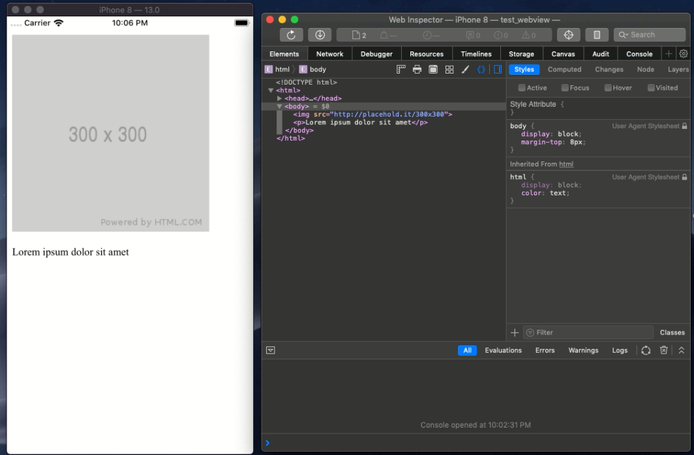
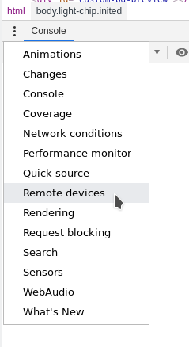
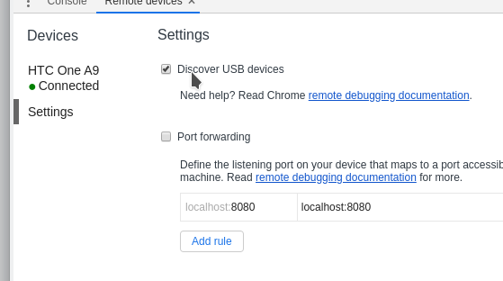
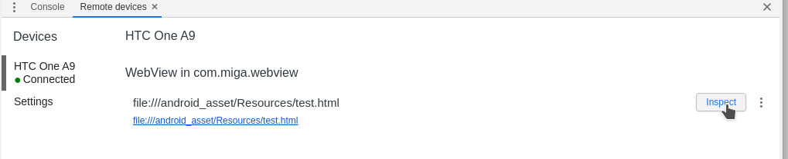
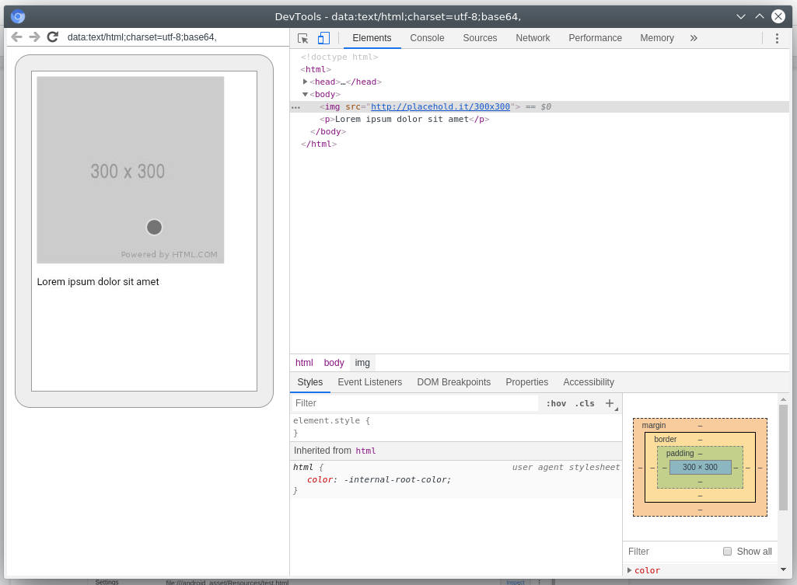

# [From zero to app](https://fromzerotoapp.com)

<span class="badge-buymeacoffee"><a href="https://www.buymeacoffee.com/miga" title="donate"></a></span>

## Debugging WebViews

<!-- START doctoc generated TOC please keep comment here to allow auto update -->
<!-- DON'T EDIT THIS SECTION, INSTEAD RE-RUN doctoc TO UPDATE -->
**Table of Contents**  *generated with [DocToc](https://github.com/thlorenz/doctoc)*

- [From zero to app](#from-zero-to-app)
  - [Debugging WebViews](#debugging-webviews)
  - [The app](#the-app)
  - [Debugging iOS](#debugging-ios)
  - [Debugging Android](#debugging-android)

<!-- END doctoc generated TOC please keep comment here to allow auto update -->

In a previous blog post Ewan Harris was talking about how to debug in VS Code (<a href="https://devblog.axway.com/mobile-apps/vs-code-debugging-for-titanium/" target="_blank">Debugging in VS Code</a>) but from time to time you have to use a WebView insider your and with an own little app inside. Normally you would debug the web application you run inside the WebView in a normal browser and then just include it in your app. It might work at first try but sometimes the WebView displays your HTML part differently than the browser on your phone and you have to debug the WebView inside your app. Luckily both Android and iOS allow you to do that.


## The app

To demonstrate the debugging part we need a small app with a WebView and some HTML content. For this you can create a new Alloy app where the controller looks like this:

```javascript
$.index.open();
```

and the view contains this code:

```xml
<Alloy>
    <Window backgroundColor="#fff">
        <WebView id="www" url="/test.html" width="Ti.UI.FILL" height="Ti.UI.FILL"/>
    </Window>
</Alloy>
```

The last thing is a HTML file called test.html inside the /assets folder:
```html
<!DOCTYPE html>
<html>

<head>
    <meta name="viewport" content="width=device-width, user-scalable=no" />
</head>

<body>
    
    <p>Lorem ipsum dolor sit amet</p>
</body>

</html>
```


When you run the app it will look like this:<br/>


## Debugging iOS

### Quick tip: Missing local files

A small note at the beginning: if you have missing files in your iOS Webview try to set `<use-app-thinning>false</use-app-thinning>` inside your tiapp.xml!

### Debug

At first we will use Safari to debug the iOS WebView. In the Safari settings you will need to enable the “Developer settings” first by setting this flag:



After that you will see all your devices and simulators inside the new “Develop” menu:



and you can click on test.html which is the WebView we have created earlier. This will open a full Safari Web Inspector with the content of your WebView Content and you can start debugging it:



Tip: you can even use the “Click to select” tool, even on a connected iPhone!

## Debugging Android

To debug an Android WebView we have to use the Chrome browser. At first we need to add the android:debuggable flag to tiapp.xml:

```xml
  <android xmlns:android="http://schemas.android.com/apk/res/android">
    <manifest>
      <application android:debuggable="true"/>
    </manifest>
  </android>
```

This will set the app into a debug mode (make sure to remove that again for your production app!) which allows Chrome to connect to the WebView. After you open Chrome you go into the DevTools (F12) and click on “More tools” menu and select “Remote devices”



Next switch on “Discover USB devices” and you should see you connected Android devices:



When you select your phone it will display the webpage again and you can click “Inspect” to open the DevTools:



Like on iOS it will show you the normal DevTools for the content of your WebView and you can start debugging it:


