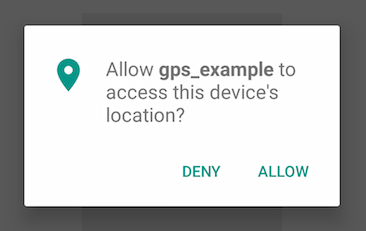

<!-- START doctoc generated TOC please keep comment here to allow auto update -->
<!-- DON'T EDIT THIS SECTION, INSTEAD RE-RUN doctoc TO UPDATE -->
**Table of Contents**  *generated with [DocToc](https://github.com/thlorenz/doctoc)*

- [From zero to app](#from-zero-to-app)
  - [Where am I?](#where-am-i)
    - [XML setup](#xml-setup)
    - [Check for location permission at runtime:](#check-for-location-permission-at-runtime)
    - [Location event](#location-event)
    - [Heading event](#heading-event)
    - [Documentation](#documentation)

<!-- END doctoc generated TOC please keep comment here to allow auto update -->

# [From zero to app](https://github.com/m1ga/from_zero_to_app)

## Where am I?

If you want to create a location based app you need to know the GPS position of the user. In order to get them we can use the  geolocation services of your phone. Since this is sensible data we need to ask the user for permission.



You add those permission into tiapp xml and request them at runtime using Ti APIs.

### XML setup

Add these parts to the tiapp.xml

iOS block:

```xml
<ios>
	<plist>
		<dict>
			<key>NSLocationWhenInUseUsageDescription</key>
			<string>[Why do you need the location?]</string>
			<key>NSLocationAlwaysAndWhenInUseUsageDescription</key>
			<string>[Why do you need the location?]</string>
		</dict>
	</plist>
</ios>
```

Android block:

```xml
<android xmlns:android="http://schemas.android.com/apk/res/android">
	<manifest>
		<uses-permission android:name="android.permission.ACCESS_FINE_LOCATION"/>
		<uses-permission android:name="android.permission.ACCESS_COARSE_LOCATION"/>
	</manifest>
</android>
```

Modules block:

```xml
<modules>
	<module platform="android">ti.playservices</module>
</modules>
```

### Check for location permission at runtime:

```javascript
function getGeoPermission(clb) {
	var hasLocationPermissions = Ti.Geolocation.hasLocationPermissions(Ti.Geolocation.AUTHORIZATION_WHEN_IN_USE);
	Ti.API.info("Already got the permission? " + hasLocationPermissions);

	if (hasLocationPermissions) {
		Ti.API.info("has permission");
		clb();
		return;
	}
	Ti.Geolocation.requestLocationPermissions(Ti.Geolocation.AUTHORIZATION_WHEN_IN_USE, function(e) {
		if (e.success) {
			// yes
			Ti.API.info("ok")
			clb();
		} else if (OS_ANDROID) {
			// no
		} else {
			// no
		}
	});
}

getGeoPermission(function(){
	// callback function - inside here we will have GPS permissions
})
```

Now the app is able to use the GPS functions and we can add a listener to get the location.

### Location event

Especially on Android it can a bit until you have a GPS fix and get the position. Also if you want to track the user while he is moving you will need a eventlistener. The `location` event will fire when the location is available or changes:


```javascript

// add this into the getGeoPermission() callback:

Ti.Geolocation.accuracy = Ti.Geolocation.ACCURACY_HIGH;
if (Ti.Geolocation.locationServicesEnabled) {
	if (OS_ANDROID) {
		// android
	} else {
		// ios
		Ti.Geolocation.accuracy = Ti.Geolocation.ACCURACY_BEST;
		Ti.Geolocation.distanceFilter = 2;
		Ti.Geolocation.preferredProvider = Ti.Geolocation.PROVIDER_GPS;
		Ti.Geolocation.pauseLocationUpdateAutomatically = true;
		Ti.Geolocation.activityType = Ti.Geolocation.ACTIVITYTYPE_FITNESS;
	}
	// add location listener
	Ti.Geolocation.addEventListener('location', onLocation);

	// try to get the current location (might be an old chacked one or empty)
	Ti.Geolocation.getCurrentPosition(onLocation);
}

function onLocation(returnObject){
	// will fire when the location updates
	Ti.API.info("location: " + JSON.stringify(returnObject));
}
```

The `returnObject` of the `location` event contains a `coords` node with `latitude` and `longitude` and other useful information like a `timestamp` or the `accuracy`

```
var errorCode = returnObject.error;
var lat = returnObject.coords.latitude;
var lon = returnObject.coords.longitude;
```

### Heading event

The `Ti.Gelocation` features another useful event for geo based apps: `heading`. With this you will get the direction your phone is heading to.

```javascript
Ti.Geolocation.addEventListener('heading', onHeading);

function onHeading(returnObject){
	// 
	console.log(returnObject.heading.magneticHeading);
	console.log(returnObject.heading.x);
	console.log(returnObject.heading.y);
	console.log(returnObject.heading.z);
}
```


### Documentation

More information and properties can be found in the official documentation at https://docs.appcelerator.com/platform/latest/#!/api/Titanium.Geolocation
