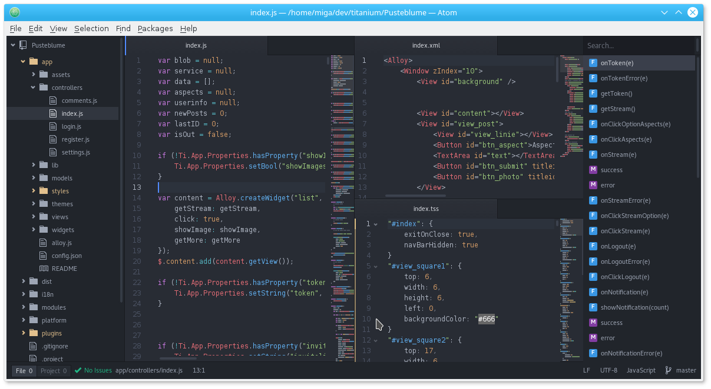
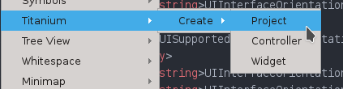

# [From zero to app](https://fromzerotoapp.com)

## How to install Appcelerator Titanium

This tutorial will get you started setting up Appcelerator Titanium and use it in combination with Atom as an editor on Linux, Windows and macOS. You can also use it with VSCode and the VSCode package.



<span class="badge-buymeacoffee"><a href="https://www.buymeacoffee.com/miga" title="donate"></a></span>


<!-- START doctoc generated TOC please keep comment here to allow auto update -->
<!-- DON'T EDIT THIS SECTION, INSTEAD RE-RUN doctoc TO UPDATE -->
**Table of Contents**  *generated with [DocToc](https://github.com/thlorenz/doctoc)*

- [Installing Appcelerator Titanium](#installing-appcelerator-titanium)
  - [Linux](#linux)
    - [Fedora](#fedora)
    - [Ubuntu](#ubuntu)
    - [For all Distros (if you don't have Node.js v10.x)](#for-all-distros-if-you-dont-have-nodejs-v10x)
  - [Windows](#windows)
    - [Node.js](#nodejs)
    - [Java JDK](#java-jdk)
  - [macOS](#macos)
    - [Java JDK](#java-jdk-1)
    - [Node.js](#nodejs-1)
  - [Android SDK](#android-sdk)
    - [Android Studio](#android-studio)
    - [manual way](#manual-way)
- [Appcelerator Titanium SDK / CLI](#axway-titanium-sdk--cli)
  - [Free Version](#free-version)
  - [Open Source Version](#open-source-version)
- [Install Atom (and some useful Packages)](#install-atom-and-some-useful-packages)
  - [Windows / macOS:](#windows--macos)
  - [Linux (Fedora):](#linux-fedora)
  - [Packages](#packages)
- [Create your first App](#create-your-first-app)
- [Compile your app](#compile-your-app)
  - [The CLI Way](#the-cli-way)
      - [iOS related](#ios-related)
  - [Shortcuts](#shortcuts)
    - [Linux / macOS](#linux--macos)
    - [Windows](#windows-1)
  - [TiShadow](#tishadow)
  - [Liveview](#liveview)
- [Link List](#link-list)
- [Contact me](#contact-me)

<!-- END doctoc generated TOC please keep comment here to allow auto update -->

## Installing Appcelerator Titanium

The current GA ('general availability') version of the SDK is 10.1.1.GA.

At first we need to setup Appcelerator Titanium:
* command line tools (CLI) to compile the apps
* the MVC framework Alloy
* some useful tools
* the SDK

The main parts are installed using the node.js package manager 'npm'. Check https://nodejs.org/ if you need to install it.

___

### Linux

#### Fedora

If you are using Fedora 26+ you can run the following commands to get the needed libraries:
```bash
# install tools and libraries
sudo dnf install nodejs npm git gcc glibc.i686 glibc-devel.i686 libstdc++.i686 zlib-devel.i686 ncurses-devel.i686 libX11-devel.i686 libXrender.i686 libXrandr.i686 java-11-openjdk
```
#### Ubuntu
``` bash
sudo apt-get install nodejs npm git gcc  gcc-multilib openjdk-11-jdk android-tools-adb
```

#### For all Distros (if you don't have Node.js v14.x)
If you do not have node v 14.x already you can up/downgrade with `n`
``` bash
# install npm version 14.x
npm install -g n
n lts
```

* Download Android SDK ("Command line tools only"): https://developer.android.com/studio#downloads
* Unzip Android SDK and run android to install SDK
* adjust you .bash_profile:

```bash
export PATH=$PATH:$HOME/android-sdk-linux/tools:$HOME/android-sdk-linux/platform-tools:/usr/java/latest/bin
export ANDROID_SDK=$HOME/android-sdk-linux

export JAVA_HOME=/usr/java/latest # fedora
```

* run `source .bash_profile` to update the current session

___

### Windows

#### Quick install

You can use this <a href="https://gist.github.com/m1ga/7c139716704fa81d11ca6f89c22e34d3">PowerShell file</a> to install all tools. Run it in a admin PowerShell and make sure to enable the Windows `dev mode` in the Windows settings.

Manual way:

* update/install the CLI (admin command prompt): npm i -g titanium alloy appcelerator
* enable "dev mode" in Windows in the security settings to run node scripts
* `ti sdk install 10.1.1.GA`  to have the latest SDK
* download OpenJDK from https://jdk.java.net/archive (11.0.2)
* extract the ZIP to e.g. `c:\programms\java\jdk-11.0.2`
* set system JAVA_HOME variable to the same folder
* restart command prompt

#### Node.js
Go to https://nodejs.org/en/download/ and download NodeJS v16.x.
If you already have a different version installed you can use nvw-windows (https://github.com/coreybutler/nvm-windows/releases) to change this version to v16.x.
~~~ bash
nvm install 16   # install a new version with nvm
nvm use 16       # set it
~~~

#### Java JDK

Download and install JDK 11 from http://www.oracle.com/technetwork/java/javase/downloads/index.html and set the JAVA_HOME env variable inside the windows advanced system settings (e.g. C:\Program Files\Java\jdk11)

___

### macOS

#### Java JDK

You can use brew to install openjdk `brew install openjdk@11`.

List available Java JDK installations:
```
/usr/libexec/java_home -V
```

select a version
```
export JAVA_HOME=$(/usr/libexec/java_home -v <JdkVersionYouWant>)
```
and put that in your `.bash_profile` or `.zprofile`
```
export JAVA_HOME=$(/usr/libexec/java_home -v 16)
```

If you are using a <b>M1 Mac</b> you have to use this version: <a href="https://github.com/microsoft/openjdk-aarch64/releases/tag/jdk-16.0.2-ga">openjdk-aarch64</a>
Homebrew's version only goes up to v11 and Oracle's v17 is not supported.

#### Node.js

- Fresh install: Go to [Nodejs.org](https://nodejs.org/en/download/) and download the v16.x (LTS).
- Upgrade: Install the Node version manager `n` and update to the LTS:
~~~ bash
npm install -g n
n lts
~~~


### Android SDK

The Android SDK is necessary if you want to compile an Android app. There are two ways to install it:

#### Android Studio
Download Android Studio and let it handle the SDK install.
If you are using the latest version of Android Studio to fetch the SDK and the needed tools make sure to uncheck `Hide Obsolete packages` and install the `SDK tools`. You might also need to copy the content from `/platform-tools/platform-tools/bin` to `/platform-tools`.

Also if you use macOS Big Sur you'll need to run `defaults write com.google.android.studio AppleWindowTabbingMode manual` in a console so Android Studio 4.1.2 won't freeze when you create an AVD or download extra SDKs.

#### manual way

Check https://github.com/appcelerator/titanium_mobile/blob/9_0_X/android/package.json#L28 for the current supported versions.
Go to https://developer.android.com/studio#cmdline-tools and download the ZIP for your platform.

Unzip and copy it to a folder (e.g. C:\android or /home/user/android). Then go into the folder `\tools\bin` and run
```bash
sdkmanager --sdk_root=/home/user/android/ --update
sdkmanager --sdk_root=/home/user/android/ "extras;android;m2repository" "platforms;android-29" "build-tools;28.0.3" "platform-tools"
sdkmanager --sdk_root=/home/user/android/ --licenses
```

* Android SDK tools
* Android SDK Platfom-tools
* Android SDK Build tools (28.0.3)
* Android 10.0 (API 29) SDK Platform
* other APIs if you like

Download the ADB tools from :
* https://dl.google.com/android/repository/platform-tools-latest-windows.zip
* https://dl.google.com/android/repository/platform-tools-latest-darwin.zip
unzip it to the android folder from before.

Add the following paths to the PATH env variable:
* C:\android\
* C:\android\platform-tools

___

## Appcelerator Titanium SDK / CLI

Open a console and run the following command to install the tools:

~~~ bash
[sudo] npm install -g titanium alloy appcelerator
~~~

After that we need to install the SDK.

### Open Source Version
You can run
~~~ bash
titanium sdk install 10.1.1.GA
~~~
to get the SDK and then
~~~ bash
 ti config wizard
 ~~~
 to finish the setup. You can check the latest GA version by going to the [Titanium Github](https://github.com/appcelerator/titanium_mobile/releases) to select the latest one.

___

## Install Atom (and some useful Packages)

### Windows / macOS:
Go to https://atom.io/ and install the Atom editor.

### Linux (Fedora):
~~~ bash
sudo dnf install $(curl -sL "https://api.github.com/repos/atom/atom/releases/latest" | grep "https.*atom.x86_64.rpm" | cut -d '"' -f 4)
~~~

### Packages

The official Appcelerator IDE package is called:

|Name | Type 	|  Features 	|
|------------------------------	|---------------	|--------------
| [Appcelerator Titanium IDE](https://atom.io/packages/appcelerator-titanium) | IDE | Official Atom package by Axway

There are some other (older) packges which are not needed when installing the official one. But it is worth mentioning them:

|Name | Type 	|  Features 	|
|------------------------------	|---------------	|--------------
| [titanium Language JavaScript](https://atom.io/packages/titanium-language-javascript) (old) | Language | JS Autocomplete (non alloy)|                    	   
| [Titanium Alloy](https://atom.io/packages/titanium-alloy) (old) | add-on| All-in-one package<br>Jump to definition<br>Open related<br>TSS Highlight|

<hr/>

Other useful non-Titanium packages/add-ons:

|Name |  Features 	|
|------------------------------	|--------------
| [Atom Beautify](https://atom.io/packages/atom-beautify) | Code beautifier (tss, xml, js support)|
| [DocBlockr](https://atom.io/packages/docblockr) | A helper package for writing documentation|
| [highlight-selected](https://atom.io/packages/highlight-selected) | Highlights the current word selected when double clicking|
| [Linter-jshint](https://atom.io/packages/linter-jshint) | Linter plugin for JavaScript (this checks your JS code)|
| [Linter](https://atom.io/packages/linter) | A Base Linter core with Cow Powers (does nothing by itself, it's an API base)|
| [minimap-highlight-selected](https://atom.io/packages/minimap-highlight-selected) | A minimap binding for the highlight-selected package|
| [minimap](https://atom.io/packages/minimap) | A preview of the full source code.|
| [pigments](https://atom.io/packages/pigments) | A package to display colors in project and files.|
| [highlight-colors](https://atom.io/packages/highlight-colors) | Alternative way to display colors in your code.|
| [color-picker](https://atom.io/packages/color-picker) | Use a color picker dialog to select a color.|
| [Platformio-ide-terminal](https://atom.io/packages/platformio-ide-terminal) | An active fork from previous terminal package for Atom, running in newer versions, complete with themes and more|
| [Project Manager](https://atom.io/packages/project-manager) | Project manager|
| [symbols-list](https://atom.io/packages/symbols-list) | Will display all functions in a sidebar|
| [sync-settings](https://atom.io/packages/sync-settings) | Syncs Atom settings, plugins etc using Gists. Very handy if you have multiple machines and want to have the same settings everywhere|
| [Terminal-plus](https://atom.io/packages/terminal-plus) | A terminal package for Atom, complete with themes and more. NOTE: will probably **fail** with newer Atom versions, try next|
| [auto-close-html2](https://github.com/yubaoquan/auto-close-html2) | Automatically close XML tags|

___

## Create your first App

For this tutorial we are just creating an empty Alloy app using CLI and Atom.

Open a new terminal and add the following :
~~~ bash
ti create
~~~

You will see a menu where you can select "Native app - Titanium SDK - set a project name - set an app id".
For the beginning, say `no` to the Test-service and Hyperloop.

You can also use the Atom package ti-create



It will create a new project inside the folder that is open in the tree-view. 'Create controller/widget' only work inside an existing Alloy project ("Open folder" - select the project folder).

___

## Compile your app

There are several ways to compile your app. You can use the simulator/emulator, deploy it to your device or create store apk's/ipa's. There is also a live test tool (TiShadow) which saves you a lot of time waiting for the compiler.

### The CLI Way

~~~ bash
# android to device
ti build -p android  -T device

# android build-only (good for testing)
ti build -p android -b --skip-minify

# android to store/file
ti build -p android -K /home/user/keyfile.keystore -T dist-playstore

# iOS simulator: will show a menu to select the size/device (e.g. press 8 for iPhone 5S
ti build -p ios -C ?

# iOS ipa/device/store: will show you a menu to select the different profiles
ti build -p ios --target ?
~~~

##### iOS related

To list all distribution names you can use:
~~~ bash
security find-identity -v -p codesigning
~~~

### Shortcuts

You can save yourself a lot of typing when you define some aliases (e.g. 'tq' will run the whole ti command to compile it and deploy it to the connected android device).

#### Linux / macOS

In **Linux/macOS** you open the *.bashrc* file and add the following aliases:

~~~ bash
# Run on Android device, skip minification to speed up the build
alias tq='ti build -p android  -T device --skip-js-minify'
# Distribute Android for Google Play, specify the required keystores
alias tbs='ti build -p android -K /home/user/keyfile.keystore -T dist-playstore'
# Create an Android APK without installing it to the device. Grab from build/android/bin
alias tq_only='ti build -p android --build-only'

# Run on iOS, specify a device
alias tq_ios='ti build -p ios -C ?'
# Distribute iOS for the App Store
alias tq_ios_store='ti build -p ios --target dist-appstore'
~~~
then you can just write "tq" to compile and install on your connected device or write "tbs" to build an apk for the play store.

#### Windows

In **Windows**, the basic aliases command is not enough (you can't attach options in alias), so you must use *.bat* files or, a better solution, powershell aliases+functions. As you may want to have it permanently on your shell session, first you must create a powershell session file, the equivalent to *.bashrc* on Linux. So, open a PowerShell command line and do:

*NOTE: You should need to activate the execution policy allowing scripts locally in order this solution to work. Open the powershell command line as administrator and type `set-executionpolicy remotesigned`*

~~~ bash
# Checking if profile exists
PS C:\> $profile
# If you cannot see/access the indicated folder, force the creation
PS C:\> New-Item -path $profile -type file -force
~~~

Ok, now you can open the *Microsoft.PowerShell_profile.ps1* file and create your functions+aliases
~~~ text
Function appcBuildAndroid {ti build -p android -T device --skip-js-minify}
New-Alias tib appcBuildAndroid

Function appcBuildPlayStore {ti build -p android -K C:\Android\Mykeys\keyfile.keystore -T dist-playstore}
New-Alias tibs appcBuildPlayStore
~~~
The next time you open a PowerShell console, you will have available the aliases *tib* and *tibs* to compile for Android or for Play Store. Of course they are examples. Do as many as you want.

*Here you can see a Windows Power Shell profile example, preconfigured: https://gist.github.com/mcvendrell/b4bacd36b834303a4e5f61afc947706a*

### TiShadow

TiShadow is another great tool by David Bankier (https://github.com/dbankier/TiShadow)

_TiShadow provides Titanium developers the ability to deploy apps, run tests or execute code snippets live across all running iOS and Android devices._

It allows you to quickly test your app on multiple devices at the same time and 'compiles' quicker then building your app all the time (about 5 seconds to get your app up and running on an android phone, for a small app). Also it works over wifi, so you don't have to have your device connected.


### Liveview

**Note:** As of SDK 8.0.0 Liveview is now part of the SDK, it is not recommended or supported to install Liveview via npm as this will conflict with the SDK version.

Now you can add `--liveview` to compile with liveview from command line

___

## Link List

Here are some useful Titanium resources:

* **Ti-Slack:**  http://tislack.org/ **Join the community!**
* Axway Appcelerator: http://appcelerator.com
* Axway Community: https://community.appcelerator.com/
* TiShadow: https://github.com/dbankier/TiShadow
* Atom: http://atom.io
* gitt.io: http://gitt.io/
* code examples: https://github.com/appcelerator/kitchensink-v2/
* official documentation/guidelines: http://docs.appcelerator.com/platform/latest/#!/guide
* official blog: https://devblog.axway.com/mobile-apps/
* official tutorials: https://tutorials.axway.com/
* official wiki: https://wiki.appcelerator.org/display/guides2/Hello+Titanium+App+Tutorial


## Contact me

Feedback appreciated.

* [twitter](http://twitter.com/michaelgangolf)
* [email](mailto:miga@migaweb.de)
* [www](http://www.migaweb.de)
