# [From zero to app](https://github.com/m1ga/from_zero_to_app)

<span class="badge-buymeacoffee"><a href="https://www.buymeacoffee.com/miga" title="donate"></a></span>

## Ah, push it

Extend you app with Firebase push notifications

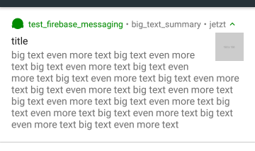

<!-- START doctoc generated TOC please keep comment here to allow auto update -->
<!-- DON'T EDIT THIS SECTION, INSTEAD RE-RUN doctoc TO UPDATE -->
**Table of Contents**  *generated with [DocToc](https://github.com/thlorenz/doctoc)*

- [From zero to app](#from-zero-to-app)
	- [Ah, push it](#ah-push-it)
	- [Project setup](#project-setup)
	- [Requirements](#requirements)
	- [Firebase setup](#firebase-setup)
	- [XML setup](#xml-setup)
	- [Code setup](#code-setup)
	- [Test it](#test-it)
	- [Notification types](#notification-types)
	- [Advanced topics](#advanced-topics)
		- [Android: custom sound](#android-custom-sound)

<!-- END doctoc generated TOC please keep comment here to allow auto update -->

## Project setup

We will start with an empty Alloy project.

```bash
ti create
# go into the folder
alloy new
```

Have a look at the last section of the [first tutorial](./first_app.md#create-a-new---clean-project).

## Requirements

-   [Firebase Core](https://github.com/hansemannn/titanium-firebase) Module for Android / iOS (only needed for iOS)
-   [Firebase Cloud Messaging](https://github.com/hansemannn/titanium-firebase-cloud-messaging) Module for Android / iOS

## Firebase setup

Go to <https://console.firebase.google.com/> and create a project.

-   create a new project:<br/>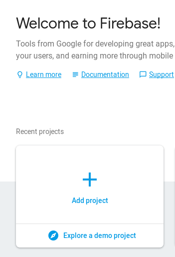

-   give it a name: <br/>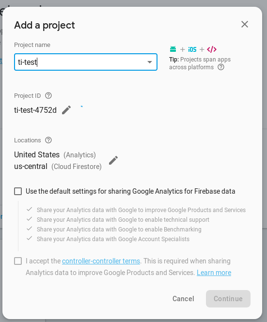

-   click on iOS / Android: <br/>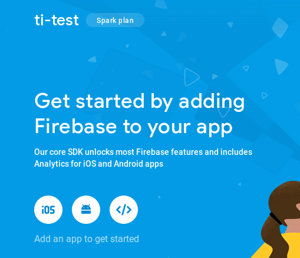

-   add your package name:<br/>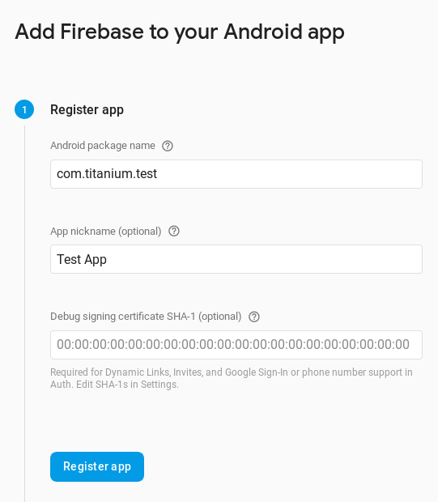

-   download the config file: <br/>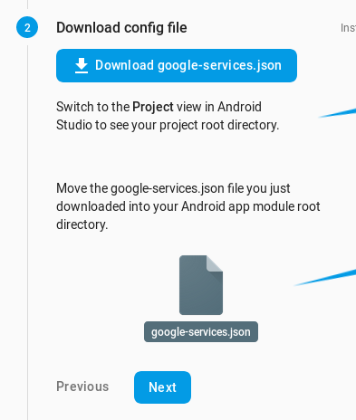

-   place it here:
-   iOS: place `GoogleService-Info.plist` into `app/assets/iphone/`
-   Android: place `google-services.json` into `/app/platform/android/`

For iOS we need to upload a p8 file.

- Go to the project settings - Cloud messaging:<br/>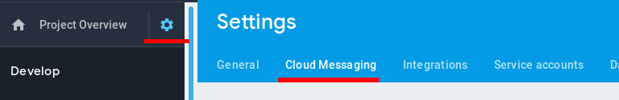
- Scroll down to the iOS app configurations and click upload (inside the APNs section):<br/>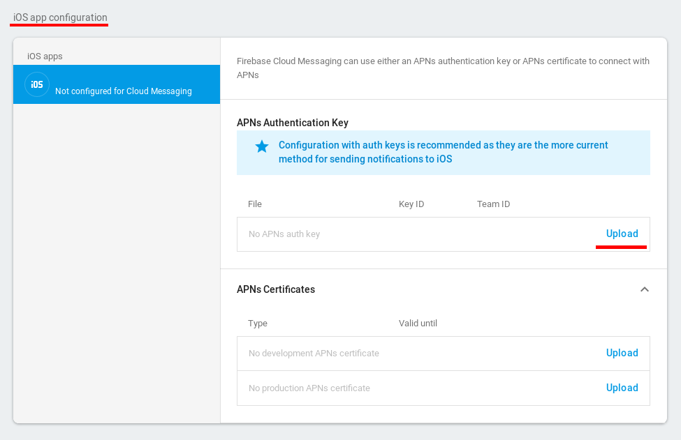
- create a APNs file:
	- go to the Apple provisioning profile center and create a new "Key":<br/>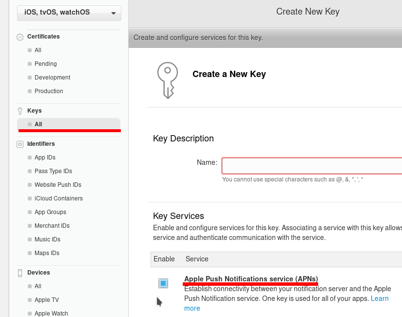
	- get the key id for later<br/>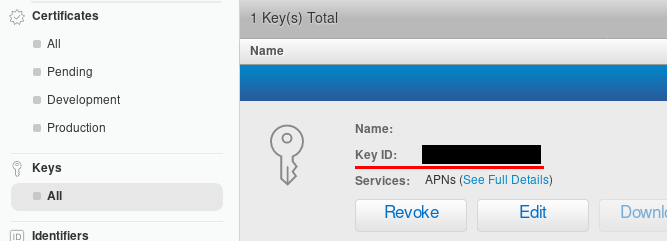
	- get the team id (link is inside the ? bubble of the upload form below):<br/>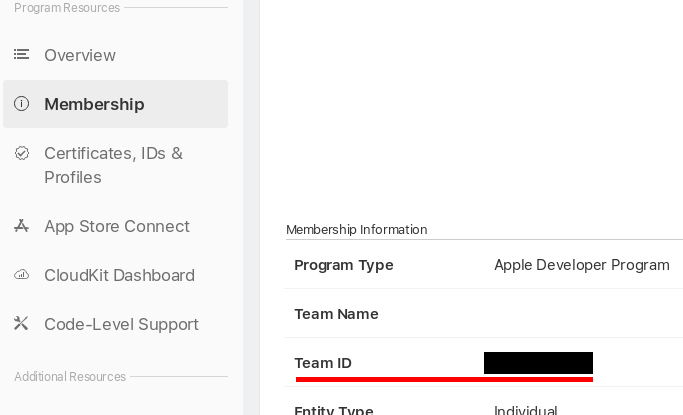
	- download the file
- Add your p8 file and fill in the key and team id:<br/>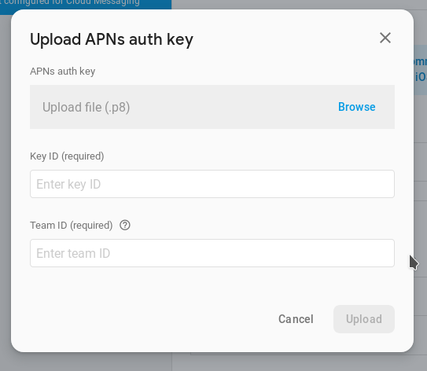


## XML setup

Download the modules and update your `tiapp.xml`:

```xml
<modules>
	<module platform="android">ti.playservices</module>
	<module platform="iphone">firebase.core</module>
	<module>firebase.cloudmessaging</module>
</modules>
```

## Code setup

For iOS you will need to add the Firebase Core module and load the config file:

```javascript
// Require the Firebase Core module
if (OS_IOS) {
	var FirebaseCore = require('firebase.core');
	FirebaseCore.configure();	// default google-services.json/GoogleService-Info.plist will be used
}
```
Android will use gradle to load the google-service.json automatically.<br/>
Then we add the Firebase Cloud Messaging module:

```javascript
var fcm = require('firebase.cloudmessaging');
if (OS_IOS) {
	Ti.App.iOS.addEventListener('usernotificationsettings', function eventUserNotificationSettings() {
		// Remove the event again to prevent duplicate calls through the Firebase API
		Ti.App.iOS.removeEventListener('usernotificationsettings', eventUserNotificationSettings);

		// Register for push notifications
		Ti.Network.registerForPushNotifications({
			success: onToken,
			error: function() {},
			callback: onMessage
		});
	});

	// Register for the notification settings event
	Ti.App.iOS.registerUserNotificationSettings({
		types: [
			Ti.App.iOS.USER_NOTIFICATION_TYPE_ALERT,
			Ti.App.iOS.USER_NOTIFICATION_TYPE_SOUND,
			Ti.App.iOS.USER_NOTIFICATION_TYPE_BADGE
		]
	});
} else {
	const channel = Ti.Android.NotificationManager.createNotificationChannel({
			id: 'default',
			name: 'Default channel',
			importance: Ti.Android.IMPORTANCE_DEFAULT,
			enableLights: true,
			enableVibration: true,
			showBadge: true
	});
	// if you use a custom id you have to set the same to the `channelId` in you php send script!
	fcm.notificationChannel = channel;
	// Register for Firebase Cloud Messaging
	fcm.registerForPushNotifications();
}

fcm.addEventListener("didRefreshRegistrationToken", onToken);
fcm.addEventListener("didReceiveMessage", onMessage);

function onToken(e) {
	// if needed: send it to your server
	if (OS_ANDROID) {
		alert("new Android token" + e.fcmToken);
	} else {
		alert("new iOS token" + fcm.fcmToken);
	}
}

function onMessage(e) {
	console.log("Got message: " + JSON.stringify(e.message));
	alert("Got message: " + JSON.stringify(e.message));
}

console.log('FCM-Token: ' + fcm.fcmToken);
if (OS_ANDROID){
	console.log('last push data: ' + fcm.lastData);
}
```

## Test it

An easy test for FCM notifications is to use this little PHP script and execture it with `php test.php`

```php
<?php
		$url = 'https://fcm.googleapis.com/fcm/send';

		$fields = [
				'to' => 'DEVICE_TOKEN', // or topic: /topics/testTopic
				'notification' => [
						'title' => 'TiFirebaseMessaging',
						'body' => 'Message received'
				],
				'data' => [
						'key1' => 'value1',
						'key2' => 'value2'
				]
		];

		$headers = [
				'Authorization: key=SERVER_ID_FROM_FIREBASE_SETTIGNS_CLOUD_MESSAGING', 'Content-Type: application/json'
		];
		$ch = curl_init();

		curl_setopt($ch, CURLOPT_URL, $url);
		curl_setopt($ch, CURLOPT_POST, true);
		curl_setopt($ch, CURLOPT_HTTPHEADER, $headers);
		curl_setopt($ch, CURLOPT_RETURNTRANSFER, true);
		curl_setopt($ch, CURLOPT_POSTFIELDS, json_encode($fields));

		$result = curl_exec($ch);

		echo $result;
		curl_close($ch);
?>
```

Make sure to change the `DEVICE_TOKEN` and `SERVER_ID_FROM_FIREBASE_SETTIGNS_CLOUD_MESSAGING`

To get the server ID go back to the Firebase Cloud console:

* go to project settings:<br/>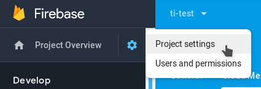
* switch to "Cloud Messaging" and copy the server key:<br/>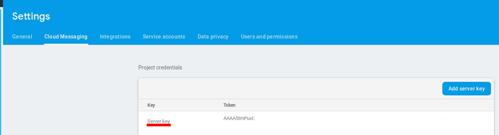

## Notification types

On Android there are two different messages that the phone can process: `Notification messages` and `Data messages`. A `notification message` is processed by the system, the `data message` is handeled by showNotification() in TiFirebaseMessagingService. A 'data message' has more features like an image or custom fields. To use it add a `data` field to your payload.

PHP example:
```php
$fields = array (
	'to' => "DEVICE_TOKEN",
	'data' => array(
		"test1" => "value1",
		"test2" => "value2",
		"title" => "title",
		"message" => "message",
		"big_text"=>"big text even more text big text even more text big text even more text big text even more text",
		"big_text_summary"=>"big_text_summary",
		//"icon" => "http://via.placeholder.com/150x150",
		//"image" => "http://via.placeholder.com/350x150",	// won't show the big_text
		"force_show_in_foreground"=> true,
		"color" => "#ff6600",
		"vibrate" => true,
		"channelId" => "default"	// or a different channel
	)
);
```

## Advanced topics

### Android: custom sound
You can place a mp3 file in `/platform/android/res/raw/` in order to play it when the push arrives. To play that sound you need to set it in the notification channel and inside the data part of the push message:

e.g. for `sound.mp3`:

```javascript
fcm.createNotificationChannel({
		sound: 'sound'
});
```
```php
$fields = [
	'to' => 'DEVICE_TOKEN',
	'data' => [
		'key1' => 'value1',
		'key2' => 'value2'
		'sound' => 'sound.mp3'
		]
];

```
